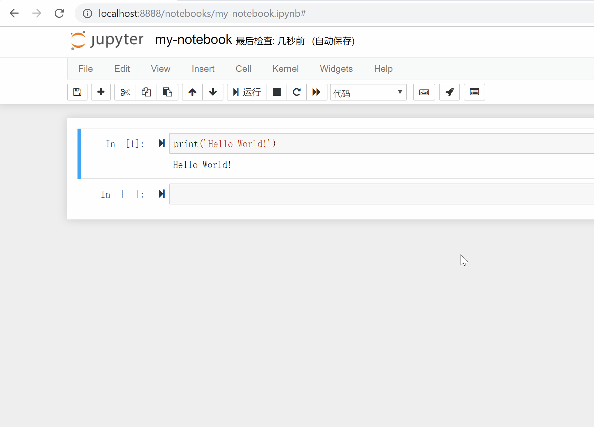

 # OpenPAI Submitter

*OpenPAI Submitter* is a Jupyter Notebook extension, created for easy-to-use job submission and management on OpenPAI clusters. Users can submit Jupyter job in one click, and manage recent jobs by a flexible dialog.



## How to Install

This extension requires **Python 3+** and Jupyter Notebook to work. Make sure you are using Jupyter Notebook with a Python 3 kernel.

Please use the following commands to install this extension (the [Python SDK](https://github.com/microsoft/pai/tree/master/contrib/python-sdk) will be installed at the same time):
```bash
pip install --upgrade pip
pip install -U "git+https://github.com/Microsoft/pai@master#egg=openpaisdk&subdirectory=contrib/python-sdk"
pip install jupyter_contrib_nbextensions
jupyter contrib nbextension install --user
git clone -b notebook-extension https://github.com/Microsoft/pai
cd pai/contrib/notebook-extension
jupyter nbextension install openpai_submitter
jupyter nbextension enable openpai_submitter/main
```

After installation, you should add description of your PAI cluster. Create a file located at ~/.openpai/clusters.yaml. If you are using Windows, the corresponding path is "C:\\Users\\<your user name>\\.openpai\\clusters.yaml". Then add the following content in it:
```YAML
- cluster_alias: <the-name-of-cluster>
  pai_uri: http://<the-ip-of-cluster>
  user: <your username>
  password: <your password>
  default_storage_alias: hdfs
  storages:
  - protocol: webHDFS
    storage_alias: hdfs
    web_hdfs_uri: http://<the-ip-of-cluster>:port
```
The cluster alias is a cluster name chosen by you, and the default port for web_hdfs_uri is 50070 (If this port doesn't work for you, please ask your administrator for the right WebHDFS URI). Multiple clusters can be added using the same pattern.

Now you can use the command below to list your clusters"
```bash
opai cluster list
```

## Quick Start

## How to Update or Uninstall

## Known Issues

## Feedback
